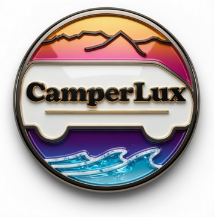
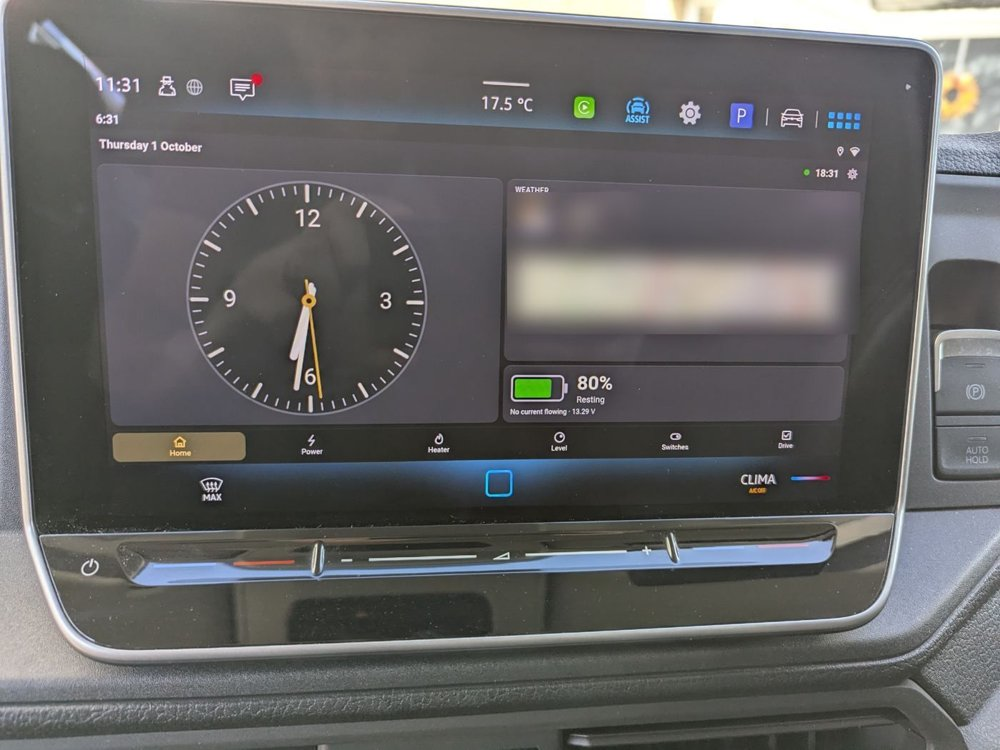

  

<h1 align="center">Camperlux</h1>

  Campervan furniture and van technology, designed and built in Yorkshire. 
  <a href="https://camperlux.co.uk">camperlux.co.uk</a>

---

Camperlux makes premium CNC-cut furniture kits for **VW Crafter and MAN TGE** campervan conversions, including the Transformer Lounge. These repositories are the technology side of that work, built and tested in our own van.

### CamperDash

The van's smart hub: one small board that talks to the battery, chargers and diesel heater over Bluetooth, switches six 12 V circuits, and knows whether the van is level, where it is, and what the weather is doing there. You see and control it all from a 4" cabin display, any phone or tablet, or the van's own dashboard screen.

  

- **Works with:** Fogstar (JBD BMS) batteries, Renogy DC-DC chargers, Victron Blue Smart chargers, and JP / SolGP diesel combi heaters
- **Hardware cost:** about £85 in parts; the hub is a Waveshare RP2350 relay board
- **Software:** MicroPython on the hub and display, a web app, and an Android app

**[Get the code: Camperlux/camperdash](https://github.com/Camperlux/camperdash)**. It's free for personal and non-commercial use; for commercial use, please get in touch.

### Get in touch

Questions, builds of your own, or commercial licensing: through [camperlux.co.uk](https://camperlux.co.uk).
